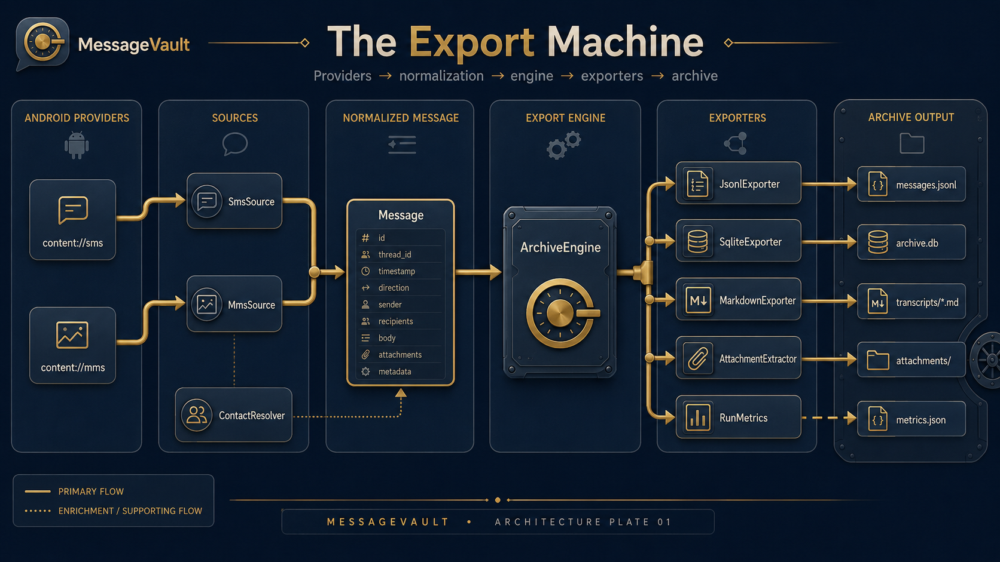

<!--
✒ Metadata
    - Title: Architecture Walkthrough (Message Vault Edition - v3.0)
    - File Name: ARCHITECTURE.md
    - Relative Path: docs/ARCHITECTURE.md
    - Artifact Type: docs
    - Version: 3.2.0
    - Date: 2026-07-21
    - Update: Tuesday, July 21, 2026
    - Author: Dennis 'dendogg' Smaltz
    - A.I. Acknowledgement: Anthropic - Claude Opus 4.8
    - Signature: ︻デ═─── ✦ ✦ ✦ | Aim Twice, Shoot Once!

✒ Changelog:
    - 3.2.0 (2026-07-21) [Anthropic - Claude Opus 4.8] — Brings the UI half of the
      walkthrough up to the app that now exists. Stop 20 described five screens that
      have since been rebuilt as an archival instrument, so it now says what each one
      actually is — accession plate, technology cards, run ledger, transcript reader,
      settings — and records the light-scheme trap where tertiary collapses into
      secondary. Stop 21 explains why the identity marks are square and unglossed.
      Stop 22 was documenting a kit of six primitives that is now forty across seven
      groups, and had no mention of STYLE.md at all: it now names the charter as the
      authority, tables the vocabulary, and states the four rules most easily broken by
      a well-meaning edit.
    - 3.1.0 (2026-07-21) [Anthropic - Claude Opus 4.8] — Opens with the Export Machine
      plate, so the whole pipeline is legible in one frame before the walkthrough takes
      it at walking pace, with a note on how to read its solid primary flow against the
      dotted enrichment path.
    - 3.0.0 (2026-07-20) [Anthropic - Claude Opus 4.8] — v1.0.0 release refresh.
      The walkthrough described a five-package app that now has seven: adds the
      service/ layer (ExportService + the process-wide ExportStatus flow) and the
      security/ layer (VaultCrypto, VaultPrefs), the Home destination, the lock
      gate and passphrase dialog, and the avatar pair. The export-run narrative
      now goes through the service rather than the ViewModel's own scope.
    - 2.0.1 (2026-07-20) [Anthropic - Claude Opus 4.8] — Header completion: the
      always-required Key Features and Other Important Information sections were
      missing, leaving the block ending at Description.
    - 2.0.0 (2026-06-22) [Anthropic - Claude Opus 4.8 (1M context)] — Rewrite for
      the navigation app: adds the storage layer, run metrics, the nav shell, the
      History / Browse / Settings screens, and the archive reader.
    - 1.0.0 (2026-06-17) [Anthropic - Claude Opus 4.8] — Initial architecture walkthrough.

✒ Description:
    The narrative companion to the per-file header docstrings. Explains how the
    pieces fit together and why the seams fall where they do, in dependency order,
    for someone new to Android, Kotlin, and Compose.

✒ Key Features:
    - Layer-by-layer walkthrough in dependency order: data/source, export,
      service, storage, security, ui, util.
    - The flat-memory invariant: why every source streams rows through
      forEach(consume) and nothing ever accumulates the whole corpus.
    - The single-streaming-pass rule: how ArchiveEngine fans one message out to
      every Exporter, so a new output format is a new Exporter plus one line.
    - The foreground-service model: how ExportService owns a run and how
      ExportStatus is mirrored into the ViewModel as a process-wide StateFlow.
    - Cancellation and failure semantics, including the cooperative
      ensureActive() checks and the read-only ArchiveReader contract.

✒ Other Important Information:
    - Dependencies: assumes the shipped toolchain baseline — AGP 8.13.2, Gradle
      8.13, JVM 21, Kotlin + Jetpack Compose (Material 3), minSdk 29,
      compileSdk/targetSdk 35. Reads as a companion to the per-file headers.
    - Compatible platforms: the document itself renders anywhere Markdown does;
      the architecture it describes is Android-only (minSdk 29).
---------
-->

# Message Vault — Architecture Walkthrough



The plate above is the whole machine in one frame, and the rest of this document
is that diagram at walking pace. Solid lines are the primary flow every message
takes; the dotted line is enrichment — `ContactResolver` decorating a message
with a name rather than carrying it.

This document is the narrative companion to the per-file header docstrings. The
headers explain each file in isolation; this explains how they fit together and,
just as important, *why* the seams fall where they do. Read it once top to bottom
and the codebase stops being a pile of files and becomes one machine with a clear
grain.

It is written for someone new to Android, Kotlin, and Gradle, so it defines the
framework pieces as they come up rather than assuming them.

## How to read this document

The walkthrough follows **dependency order** — bottom of the stack first, top
last. Each stop builds only on what came before it, so by the time a file calls
into another, you have already met the callee.

## The big picture

Message Vault does three things: it **exports** your SMS/MMS off the device into
durable formats, it **reads them back** on-device, and it **seals** what leaves
the phone. Everything on the export side is arranged around a single streaming
pass so a 50,000-message history never has to fit in memory at once.

The export data flows in one direction, left to right:

```text
Android providers          normalized            selected outputs
(content://sms,            vocabulary            (files on disk)
 content://mms)                |                       |
        |                      v                       v
   SmsSource / MmsSource ── Message ──▶ ArchiveEngine ──▶ JsonlExporter
        |                      ^             |       └──▶ SqliteExporter
   ContactResolver ───────────┘             |       └──▶ MarkdownExporter
                                            ├──────────▶ AttachmentExtractor
                                            └──────────▶ RunMetrics → metrics.json
```

Crucially, the engine is **not** driven from the UI's coroutine scope. A
foreground service owns the run, and the UI only observes it:

```text
ArchiveViewModel ──starts──▶ ExportService (foreground, dataSync)
        ▲                            │ owns the run job
        │ collects                   ▼
        └──────────────── ExportStatus (process-wide StateFlow)
                                     │
                                     └──▶ progress notification (+ Cancel action)
```

The UI is a navigation-drawer app sitting on top, with five destinations behind a
lock gate:

```text
MainActivity ──hosts──▶ LockScreen gate ──▶ AppRoot (drawer + top bar + NavHost)
      |                                       ├─▶ HomeScreen     (Home)     ◀── RunHistory
      |                                       ├─▶ ArchiveScreen  (Export)   ◀── ArchiveViewModel ─▶ ExportService
      |                                       ├─▶ HistoryScreen  (History)  ◀── RunHistory
      |                                       ├─▶ BrowseScreen   (Browse)   ◀── ArchiveReader
      └──owns──▶                              └─▶ SettingsScreen (Settings) ◀── ExportLocation / VaultPrefs / ThemeMode
```

## The layers

| Package        | Responsibility                                              |
| -------------- | ----------------------------------------------------------- |
| `data/model`   | The shared vocabulary every other layer speaks.             |
| `data/source`  | Reading raw data out of Android's content providers.        |
| `export`       | Turning normalized messages into output files + metrics.    |
| `service`      | Owning a run outside the UI, and publishing its status.     |
| `storage`      | Where exports live, how they're delivered, and reading back.|
| `security`     | The vault: passphrase sealing and the three vault switches. |
| `util`         | Tiny leaf helpers with no app-logic dependencies.           |
| `ui`           | Navigation, state management, the lock gate, and the five screens. |
| `ui/theme`     | Colors and typography (the digiSpace palette).              |

## The guided tour

### Stop 1 — the vocabulary (`data/model/Models.kt`)

`Message`, `Attachment`, `Direction`, `Kind`, `ExportProgress`. SMS and MMS come
out of Android with totally different column sets but both collapse into the same
`Message`, which is why every later layer can stay ignorant of which kind it is
handling. `epochMillis` is normalized to milliseconds for both.

### Stop 2 — naming the unknown (`data/source/ContactResolver.kt`)

Turns a phone number into a display name via `ContactsContract.PhoneLookup`, and
caches every answer (including "no match"). Degrades gracefully to numbers if the
contacts permission is missing.

### Stop 3 — the easy reader (`data/source/SmsSource.kt`)

Reads plain text messages. The structural idea is `forEach(consume)`: instead of
returning a giant list, the source feeds messages out one at a time, so the
cursor lives only as long as the loop and nothing piles up in memory. SMS dates
arrive in milliseconds.

### Stop 4 — the freakshow (`data/source/MmsSource.kt`)

Reconstructs each MMS from three queries (message, parts, addresses). Two
landmines are defused here: MMS dates arrive in *seconds* (multiplied by 1000 to
normalize), and every MMS carries a layout-only `application/smil` part (skipped).
Attachments are catalogued here, not read; their bytes stream later.

### Stop 5 — the contract for outputs (`export/Exporter.kt`)

`open` → many `write` → `close`. Coding the engine against this interface is what
makes JSONL, SQLite, and Markdown interchangeable.

### Stop 6 — the three writers

1. `JsonlExporter` — one JSON object per line; streamable on both ends.
2. `SqliteExporter` — a standalone indexed `.db`. Compiles its INSERT statements
   **once** and rebinds them per row (not per message) for speed at scale.
3. `MarkdownExporter` — one readable transcript per thread, lazily opened.

### Stop 7 — pulling the bytes (`export/AttachmentExtractor.kt`)

Streams each attachment's bytes straight from the provider to a real file, names
it collision-safely, and stamps `Attachment.exportName` back on. Tracks
`filesExtracted` / `bytesExtracted` for the metrics.

### Stop 8 — the conductor (`export/ArchiveEngine.kt`)

Opens the selected exporters, makes one streaming pass over SMS then MMS, runs
each message through the extractor, fans it out to every exporter, times each
phase and sink, and writes both `MANIFEST.md` and `metrics.json`. The whole run
is inside `withContext(Dispatchers.IO)`; cancellation is cooperative via
`ensureActive()`; exporters close in a `finally`.

### Stop 9 — the instrumentation (`export/RunMetrics.kt`)

An immutable snapshot of one run: wall clock, per-phase + per-sink timing,
throughput, SMS/MMS counts, attachment count + bytes, and date range. Serializes
to `metrics.json` and contributes lines to `MANIFEST.md`. Holds only numbers, so
it never threatens flat memory.

### Stop 10 — the run's owner (`service/ExportService.kt`)

The engine used to be driven from the ViewModel's scope, which is fine while the
user watches and fragile the moment they leave — Android is free to kill a
backgrounded process, taking a half-written archive with it. `ExportService` is a
foreground service (`dataSync`) that owns the run job, posts a live progress
notification with a Cancel action, and publishes `ExportStatus`, a **process-wide
`StateFlow`** the ViewModel merely mirrors. That last part is what lets the UI
attach to a run it did not start and survive rotation or a trip to the launcher.

Notification updates are rate-limited (the engine reports every 200 messages,
which would hammer the shade), and success, failure, and cancellation each settle
both the flow and the notification in a `finally`.

### Stop 11 — where exports live (`storage/ExportLocation.kt`)

Decides the run directory: the browsable public `/sdcard/MessageVault/exports/`
when "All files access" is granted, else the app-private sandbox. This is what
lets a personal archival tool actually hand the data back, since Android 11+
scoped storage hides `Android/data` from file managers.

### Stop 12 — delivering a run (`storage/RunDelivery.kt`)

Streams a finished run into a single `.zip` (to Share via any app) or writes that
zip into a folder picked through the Storage Access Framework (e.g. OneDrive).
One zip serves both routes so the nested `attachments/` tree never has to be
recreated through the document API. The MIME type is derived from the file, not
hardcoded — a sealed `.mvault` announced as `application/zip` gets renamed by
document providers into `<run>.mvault.zip`, failing far from the cause.

### Stop 13 — listing past runs (`storage/RunHistory.kt`)

Reads each run directory's `metrics.json` into a lightweight `RunSummary` for the
History and Home screens. No message data is loaded — just the headline numbers,
which is why both screens stay instant regardless of corpus size.

### Stop 14 — reading it back (`storage/ArchiveReader.kt`)

Opens the latest `archive.db` READ-ONLY and serves the conversation list, the
messages in a thread, and a body search. The proof that exporting a portable
SQLite file means you can re-open it like any other database. It is a hard rule
that this layer never throws into the UI: a missing, empty, or unreadable archive
becomes an empty result or a handled error state, never a crash.

### Stop 15 — the envelope (`security/VaultCrypto.kt`)

Seals a run's zip into a `.mvault` — AES-256-GCM under a key derived by
PBKDF2-HMAC-SHA256 from a passphrase, with a random per-file salt and nonce.

The choice worth understanding is **passphrase, not Android Keystore**. A Keystore
key dies with the phone, and an archive you cannot open in ten years is not an
archive. So the header is plaintext and self-describing (magic, KDF id, iteration
count, salt, nonce), the format is documented in the file itself and in the
README, and `tools/decrypt_mvault.py` implements it in ~100 lines of Python that
depend on neither this app nor Android. GCM authenticates, so a wrong passphrase
fails loudly instead of producing garbage. Encryption streams through
`CipherOutputStream`, honoring the same flat-memory rule as the exporters.

Nothing here can recover a forgotten passphrase, and nothing was designed so it
could.

### Stop 16 — the three switches (`security/VaultPrefs.kt`)

`lockEnabled`, `secureScreen`, `encryptExports`, persisted in the same
`SharedPreferences` file as the theme and export config. It holds **only
booleans** — the type system here cannot hold a passphrase, which is the point. A
stored passphrase would reduce the vault to a locked door with the key taped to it.

### Stop 17 — holding the state (`ui/ArchiveViewModel.kt`)

Owns the Export screen's state and mirrors `ExportStatus` into it, so the screen
reflects the service's run rather than one of its own. Cancellation is handled
explicitly so a user cancel settles on "Cancelled.", not a false "Failed.".

### Stop 18 — the door (`ui/LockScreen.kt`, `ui/PassphraseDialog.kt`)

`LockScreen` wraps the *entire* UI, not one screen — the archive is every message
the user has ever sent. It uses `BiometricPrompt` with `DEVICE_CREDENTIAL`
fallback (never a passphrase this app invented and stored), re-locks on `ON_STOP`,
and never composes the content while locked, so the message list cannot flash
before the prompt appears.

`PassphraseDialog` collects the sealing passphrase at the moment of sealing,
asks for it twice, and hands back a `CharArray` rather than a `String` so the
caller can zero it — `String` is immutable and lingers in the heap.

### Stop 19 — the shell (`ui/AppNav.kt`)

`ModalNavigationDrawer` + `Scaffold(TopAppBar)` + `NavHost`. The drawer lists the
five destinations from the `Dest` enum; the bar shows the current one; the NavHost
swaps content while keeping a back stack. The drawer footer pins a one-tap
SYSTEM/LIGHT/DARK toggle, the live export location, and the version.

### Stop 20 — the five screens

Each destination is a view onto the same archive, and each is written to read as
a **records instrument** rather than a phone app. That constraint is not a matter
of taste — it is written down in [STYLE.md](STYLE.md) and enforced per screen.

- `HomeScreen` — the front plate. It states the condition of the holdings rather
  than greeting anyone: the latest **accession** by its `yyyyMMdd_HHmmss` catalogue
  slug, a `COMPLETE` / `STALE` stamp, its measured figures as a right-aligned
  manifest of `MvFieldRow`s, then the operations and the inventory roll-up.
- `ArchiveScreen` (Export) — one card per option, each carrying the mark of the
  technology it produces (`ic_tech_jsonl`, `ic_tech_sqlite`, `ic_tech_markdown`,
  plus platform glyphs for SMS / MMS / attachments). A selected card carries the
  accent in border, chip and fill, so the chosen set is legible at a glance. The
  running state is a gold sweep along the meter, a phase crossfade and a breathing
  dot — motion that exists because the engine only reports every 200 messages and
  a still bar is indistinguishable from a frozen one.
- `HistoryScreen` — the run ledger: an aggregate header, one record per past run
  with its metrics, and Share / Copy / guarded delete.
- `BrowseScreen` — the reader, and the screen that carried the most risk of the
  app looking like something it is not. A **ledger index** (correspondent and
  thread id left, record count and stamp right) opens a thread rendered as
  full-width **transcript records** — never chat bubbles. Direction is carried by
  a square rule in the gutter and a named speaker, the way a transcript attributes
  a line. Tapping the correspondent hands off to the **system contact card**,
  deliberately: an archive resolves who someone is; it does not become a client
  that can contact them.
- `SettingsScreen` — storage usage, the Vault switches, the default export
  configuration, notifications, appearance, and About (which is also where
  *Share this app* lives — the one "share" in the app that does not mean handing
  someone your messages).

`ui/theme` maps the locked digiSpace palette (navy / gold / slate / parchment)
onto Material 3's roles in both light and dark, with crimson reserved for errors.
One trap worth knowing before you reach for a colour: **in the light scheme
`tertiary` and `secondary` are both slate**, so any design that distinguishes two
things by that pair collapses to one colour in light mode. STYLE.md bans
`tertiary` app-wide for exactly this reason.

### Stop 21 — the faces (`ui/AbstractAvatar.kt`, `ui/ContactAvatar.kt`)

`AbstractAvatar` derives a deterministic generative mark from a seed (name or
number) via an FNV-1a hash feeding an xorshift PRNG — same seed, same mark,
forever, with no artwork stored anywhere and only palette colors used.
`ContactAvatar` prefers the saved contact's photo from the **live** contacts
database and falls back to the generated mark whenever there is no photo, no
permission, or an unreadable stream. Because the photo comes from the live
database rather than the archive, browsing a year-old export shows today's
photos, and a contact deleted since the export quietly reverts to its mark.

Both render as **square specimen plates**, not circles, and the generated mark
has no gloss pass. That is deliberate: after the chat bubble, the round glossy
avatar is the most recognisable social-app signature there is. A specimen plate
is how an archive depicts a subject; a glossy circle is how a social app depicts
a friend.

### Stop 22 — the shared design system (`ui/UiKit.kt`) and its charter

Every screen used to carry a private twin of the same card, label and button, so
spacing and radii drifted apart as the app grew. `UiKit` is the single source of
that vocabulary, and [STYLE.md](STYLE.md) is the written charter it implements.
**Read the charter before adding to the kit**; it records not just the rules but
why each one exists and which conflicts were resolved to get there.

The governing test the charter sets: *would this element be at home on a catalogue
card, a transcript page, or a bound register?* Three shapes are banned outright —
the **bubble**, the gradient **lozenge**, and the round glossy **avatar**.

The kit divides into tokens and primitives:

| Group | What it holds |
| --- | --- |
| Tokens | `MvSpace`, `MvShape` (Card / Control / Plate / Mark), `MvAlpha` + `MvInk`, `MvType`, `MvMotion`, `MvDirection`, `MvIcons`, `MvGutterWidth`, the width caps and `MvTouchTarget` |
| Surfaces | `MvCard`, `MvPlate`, `MvIdentityFrame` |
| Rules | `MvRule`, `MvVerticalRule`, `MvDayRule`, `MvCardFooter`, `MvSectionLabel` |
| Data | `MvFieldRow`, `MvStatPlate` / `MvStatCell`, `MvFigure`, `MvMono`, `MvCatalogId`, `MvPathText`, `MvNum` |
| Status | `MvStamp` + `MvTone`, `MvNote`, `MvInlineAck` |
| Controls | `MvStateToggle`, `MvSelectMark`, `MvModeStrip`, `MvQueryField`, `MvPrimaryButton`, `MvSecondaryButton`, `MvTextAction` |
| Readouts | `MvMeter`, `MvMeasuring`, `MvConfirmDialog`, `MvReveal`, and the `MvLoadingState` / `MvEmptyState` / `MvErrorState` trio |

Four rules carry most of the weight, and they are the ones most easily broken by
a well-meaning edit:

1. **Monospace is the voice of the record** — every figure, stamp, identifier,
   path and field label. Sans is the voice of language — message bodies, names,
   prose. Never a figure in sans; never a sentence in mono.
2. **Data is the brightest ink, its label the dimmest.** `MvInk` quantises to
   five values so this inversion holds everywhere instead of drifting.
3. **Cards carry a hairline, never elevation.** A Material card rasterises the
   same rounded rect three times — shadow, fill, clip — and at low contrast those
   antialiased edges leave a visible ring traced inside every corner.
4. **Motion is opacity only**, at `MvMotion.Snap` or `Settle`. No translation, no
   stagger, no decorative movement.

A screen that needs something the kit lacks should add it *here*, not locally.

### Stop 23 — the shade (`util/Notifications.kt`)

One place that knows how to talk to the notification shade. It creates both
channels (delivery and exports) at process start, and builds the ongoing
progress entries and their terminal results. Two details are load-bearing: the
small icon is an **alpha mask**, so it must stay a flat silhouette or Android
renders a white blob; and the export *result* deliberately uses a different
notification id from the export *progress*, because progress is the foreground
service's own notification and `stopForeground(STOP_FOREGROUND_REMOVE)` deletes
whatever carries that id — a result posted under it would vanish on sight.

### Stop 24 — the entry points (`MainActivity.kt`, `MessageVaultApp.kt`)

`MainActivity` hosts the lock gate and `AppRoot`, brokers the runtime SMS grant
and the All-files access flow, owns the persisted theme mode and vault settings,
applies `FLAG_SECURE` when screen privacy is on, and wires the share/copy
intents — including `prepareBundle`, which zips a run and, when a passphrase was
supplied, seals it and deletes the plain zip so an unencrypted copy never lingers
in cache. `MessageVaultApp` is the (currently empty) Application object.

## How a single export runs

1. On **Export**, you tap **Run export**; `ArchiveViewModel` starts
   `ExportService` with the config as intent extras.
2. The service calls `startForeground` with a progress notification (carrying a
   Cancel action), sets `ExportStatus` to running, and launches the run job on its
   own `Dispatchers.IO` scope. The ViewModel collects `ExportStatus` from here on.
3. `ArchiveEngine.run(config)` resolves the run directory via `ExportLocation`,
   opens the selected exporters, and counts messages for a real total.
4. It streams SMS then MMS; for each message it extracts attachments, fans out to
   every exporter, times each phase and sink, and reports progress every 200
   messages (which the service throttles before touching the shade).
5. Both loops returning normally is the only thing that calls `markComplete()` —
   that is what commits the SQLite transaction. Cancellation or a throw skips it,
   and the partial `.db` is rolled back and deleted.
6. The engine writes `metrics.json` + `MANIFEST.md`. The service settles
   `ExportStatus` with the summary (qualified with the attachment failure count if
   any), replaces the progress notification with a completion one, and stops
   itself. The Export screen flips to Done with Share / Copy actions.
7. If **Encrypt shared exports** is on, Share and Copy route through
   `PassphraseDialog` → `RunDelivery.zip` → `VaultCrypto.encrypt`, and the plain
   zip is deleted before the `.mvault` is handed to the chooser or the SAF tree.

## How browse works

`BrowseScreen` asks `ArchiveReader.latestDb()` for the newest `archive.db`, loads
the conversation list (one ordered pass), and shows it. Tapping a conversation
loads that thread's messages as chat bubbles; the search box runs a debounced
`LIKE` query across message bodies. All read-only.

## Where to extend it next

- A new output format is a new `Exporter` plus one line in the engine's list.
- A new screen is a new `composable` in the `NavHost` plus a `Dest` entry.
- Group MMS threads (multiple recipients) is a change inside `MmsSource.readSender`
  and the `Message` model, nothing else.
- A second KDF or cipher is a new id byte in the `.mvault` header — the format was
  built self-describing so old archives keep opening.

Whatever gets added, two invariants are not negotiable: **flat memory** (nothing
accumulates the corpus) and the **single streaming pass** (the history is read
exactly once per run).

## The build files, briefly

Read them in this order: `settings.gradle.kts` (modules + repositories), the root
`build.gradle.kts` (plugins), `app/build.gradle.kts` (the app recipe), and
`gradle/libs.versions.toml` (the version catalog). The version baseline and the
path to AGP 9.x live in `UPGRADING.md`.

---

︻デ═─── ✦ ✦ ✦ | Aim Twice, Shoot Once!
